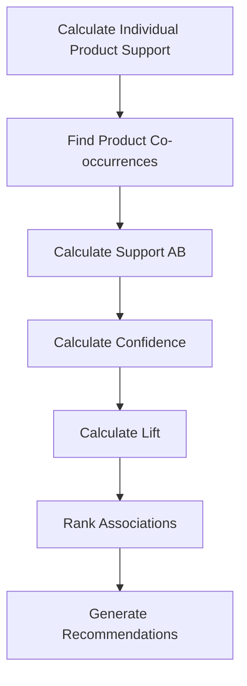

# 🎓 Project Methodology

## Market Basket Analysis Framework

This project follows a structured 4-part framework for conducting comprehensive market basket analysis.

---

## Part 1: Problem Framing & Business Questions

### Problem Statement
**"Which products are frequently purchased together, and how can we use these patterns to create product bundles and cross-sell recommendations that increase average order value?"**

### Business Context
- **Company:** UK-based online gift retailer
- **Business Model:** B2C retail + B2B wholesale
- **Challenge:** Maximize average order value through strategic product bundling
- **Opportunity:** Identify natural product associations for cross-selling

### Key Questions Framework

| Question Type | Specific Question | Analysis Method |
|---------------|-------------------|-----------------|
| **SIZE** | What is the average basket size? | Descriptive statistics |
| **RANK** | Which product pairs have highest purchase rates? | Association rule mining |
| **EXPLAIN** | What drives customers to buy products together? | Lift analysis |
| **COMPARE** | How do patterns vary by country/time? | Segmentation analysis |
| **RECOMMEND** | Which 5 bundles maximize AOV? | Prioritization matrix |

---

## Part 2: Data Requirements & Gathering

### Source Data Mapping

```
UCI Online Retail Dataset → SQL Database Schema
│
├── InvoiceNo      → Primary transaction identifier
├── StockCode      → Product SKU
├── Description    → Product name
├── Quantity       → Items per transaction
├── InvoiceDate    → Transaction timestamp
├── UnitPrice      → Price in GBP
├── CustomerID     → Customer identifier
└── Country        → Customer location
```

### KPI Definitions

#### Transaction-Level KPIs
```sql
-- Basket Size
COUNT(DISTINCT StockCode) 
GROUP BY InvoiceNo

-- Line Total
Quantity * UnitPrice_USD

-- Order Value
SUM(LineTotal_USD) 
GROUP BY InvoiceNo
```

#### Association Rule Metrics
```sql
-- Support(A)
Support(A) = Orders_Containing_A / Total_Orders

-- Support(A,B)
Support(A,B) = Orders_With_Both_A_and_B / Total_Orders

-- Confidence(A→B)
Confidence(A→B) = Support(A,B) / Support(A)

-- Lift(A,B)
Lift(A,B) = Support(A,B) / (Support(A) × Support(B))
```

### Data Quality Thresholds

| Criterion | Threshold | Rationale |
|-----------|-----------|-----------|
| Minimum co-occurrences | 10 orders | Statistical significance |
| Minimum Lift | 1.5 | Meaningful association |
| Customer ID completeness | >70% | Customer-level analysis |
| Price validity | >0 | Exclude test records |

---

## Part 3: Data Analysis (5-Stage Approach)

### Stage A: Exploring Data

**Objectives:**
- Understand data structure
- Identify data types
- Determine date ranges
- Count unique entities

**Key SQL Queries:**
```sql
-- Overall statistics
SELECT 
    COUNT(*) AS Total_Transactions,
    COUNT(DISTINCT InvoiceNo) AS Unique_Invoices,
    COUNT(DISTINCT StockCode) AS Unique_Products,
    COUNT(DISTINCT CustomerID) AS Unique_Customers,
    MIN(InvoiceDate) AS First_Date,
    MAX(InvoiceDate) AS Last_Date
FROM staging.OnlineRetail_Raw;
```

### Stage B: Profiling Data

**Objectives:**
- Analyze distributions
- Identify outliers
- Discover patterns
- Detect anomalies

**Analysis Areas:**
1. **Basket Size Distribution**
   - Small baskets: 1-2 items
   - Medium baskets: 3-5 items
   - Large baskets: 6+ items

2. **Revenue Distribution**
   - Pareto principle (80/20 rule)
   - Top revenue-generating products
   - High-volume vs high-value items

3. **Temporal Patterns**
   - Peak shopping hours
   - Day-of-week patterns
   - Seasonal trends

### Stage C: Cleaning Data

**Data Quality Issues & Solutions:**

| Issue | Records Affected | Solution |
|-------|------------------|----------|
| Cancellations (InvoiceNo starts with 'C') | ~9,000 | Remove from analysis |
| Returns (Negative Quantity) | ~10,000 | Exclude negative quantities |
| Missing CustomerID | ~135,000 | Flag but include in product analysis |
| Invalid StockCodes (POST, D, M, etc.) | ~1,000 | Exclude system codes |
| Zero/Negative Prices | ~1,500 | Remove invalid prices |

**Cleaning SQL Logic:**
```sql
-- IsValid flag logic
CASE 
    WHEN LEFT(InvoiceNo, 1) = 'C' THEN 0  -- Cancellation
    WHEN Quantity <= 0 THEN 0              -- Return or zero qty
    WHEN UnitPrice <= 0 THEN 0             -- Invalid price
    WHEN CustomerID IS NULL THEN 0         -- Missing customer
    WHEN StockCode IN ('POST','D','M') THEN 0  -- System code
    ELSE 1  -- Valid transaction
END AS IsValid
```

### Stage D: Shaping Data

**Creating the Order-Product Matrix:**

```sql
-- Step 1: Create distinct order-product combinations
SELECT DISTINCT
    InvoiceNo,
    StockCode,
    Description
INTO #OrderProducts
FROM prod.vw_ValidTransactions;

-- Step 2: Self-join to find product pairs
SELECT 
    a.StockCode AS ProductA,
    b.StockCode AS ProductB,
    COUNT(DISTINCT a.InvoiceNo) AS OrdersWithBoth
FROM #OrderProducts a
INNER JOIN #OrderProducts b
    ON a.InvoiceNo = b.InvoiceNo
    AND a.StockCode < b.StockCode  -- Avoid duplicates
GROUP BY a.StockCode, b.StockCode
HAVING COUNT(DISTINCT a.InvoiceNo) >= 10;
```

**Why Self-Join?**
- Finds all product pairs that appear in the same order
- `a.StockCode < b.StockCode` prevents duplicate pairs (A-B = B-A)
- `HAVING COUNT >= 10` ensures statistical significance

### Stage E: Analyzing Data

**Market Basket Analysis Workflow:**



**Analysis Steps:**

1. **Calculate Product Support**
   ```sql
   SELECT 
       StockCode,
       COUNT(DISTINCT InvoiceNo) AS OrderCount,
       CAST(COUNT(DISTINCT InvoiceNo) * 1.0 / @TotalOrders AS DECIMAL(10,6)) AS Support
   FROM prod.vw_ValidTransactions
   GROUP BY StockCode;
   ```

2. **Find Product Pairs**
   ```sql
   -- Products appearing together in orders
   -- Minimum 10 co-occurrences for significance
   ```

3. **Calculate Association Metrics**
   ```sql
   -- Support, Confidence, Lift for each pair
   -- Filter by Lift > 1 (positive associations only)
   ```

4. **Rank and Prioritize**
   ```sql
   -- Top pairs by Lift (association strength)
   -- Top pairs by Support (frequency)
   -- Top pairs by Confidence (conversion rate)
   ```

---

## Part 4: Presentation & Recommendations

### Analysis Outputs

#### 1. Data Tables
- **prod.ProductPairs**: All association rules
- **prod.vw_TopProductAssociations**: Top 100 associations
- **prod.vw_ValidTransactions**: Cleaned transactions

#### 2. Key Insights Document
- Top 5 product bundles to implement
- Cross-sell recommendations by product
- Basket size analysis
- Revenue impact estimates

#### 3. Business Recommendations
- Product bundling strategy
- Website optimization (product placement)
- Email marketing campaigns
- Inventory management insights
- A/B testing roadmap

### Recommendation Framework

**Priority Matrix:**

| Lift Score | Support Score | Action Priority |
|------------|---------------|-----------------|
| ≥5 (Very Strong) | ≥0.01 (1%) | **Immediate Implementation** |
| 3-5 (Strong) | ≥0.005 (0.5%) | **High Priority** |
| 2-3 (Moderate) | ≥0.003 (0.3%) | **Medium Priority** |
| 1.5-2 (Weak) | ≥0.001 (0.1%) | **Low Priority** |

**Discount Strategy:**

```
IF Lift ≥ 5:
    Recommended Discount = 15%
ELIF Lift ≥ 3:
    Recommended Discount = 10%
ELSE:
    Recommended Discount = 7%
```

### Success Metrics

**Implementation Tracking:**

| Metric | Baseline | Target | Measurement Period |
|--------|----------|--------|-------------------|
| Average Order Value | $X | +15% | 3 months |
| Basket Size | Y items | +10% | 3 months |
| Cross-sell Conversion | Z% | +20% | 3 months |
| Bundle Attachment Rate | N/A | >25% | 3 months |

---

## Technical Implementation Notes

### SQL Server Optimization
- **Indexes:** Created on InvoiceNo, StockCode, CustomerID
- **Temp Tables:** Used for intermediate calculations
- **CTEs:** Used for complex multi-step queries
- **Window Functions:** For rankings and running totals

### Performance Considerations
- **Total Execution Time:** ~5 minutes for complete analysis
- **Database Size:** ~150MB
- **Query Response Time:** <2 seconds for dashboard queries
- **Scalability:** Handles 500K+ transactions efficiently

### Code Organization
```
SQL_Scripts/
├── 01_Database_Setup.sql          -- 5 min
├── 02_Data_Exploration.sql        -- 2 min
├── 03_Data_Cleaning.sql           -- 3 min
├── 04_Market_Basket_Analysis.sql  -- 10 min (most intensive)
├── 05_Product_Pairs_Deep_Dive.sql -- 5 min
└── 06_Business_Insights.sql       -- 2 min
```

---

## Validation & Quality Assurance

### Data Validation Checks

1. **Row Count Validation**
   ```sql
   -- Verify no data loss during transformations
   SELECT COUNT(*) FROM staging vs prod
   ```

2. **Revenue Validation**
   ```sql
   -- Ensure LineTotal calculations are accurate
   SELECT SUM(LineTotal_USD) vs SUM(Qty * Price)
   ```

3. **Association Metric Validation**
   ```sql
   -- Verify Lift formula
   -- Lift should always be positive for included pairs
   ```

4. **Business Logic Validation**
   ```sql
   -- No product should pair with itself
   -- Support values should be between 0 and 1
   -- Confidence values should be between 0 and 1
   ```

---

## Limitations & Assumptions

### Known Limitations
1. **Missing Customer Data:** ~25% of transactions lack CustomerID
2. **Fixed Exchange Rate:** Single GBP→USD rate for entire period
3. **No Product Categories:** Products identified by description only
4. **Time Zone:** All timestamps in UTC, no local adjustment
5. **Wholesale Skew:** Large wholesale orders may influence averages

### Key Assumptions
1. **Independence:** Each transaction is independent
2. **Stationarity:** Product relationships are stable over time
3. **Completeness:** Dataset represents full transaction history
4. **Quality:** Source data is accurate and reliable

---

## Future Enhancements

### Potential Extensions
1. **Customer Segmentation:** RFM analysis + persona creation
2. **Time Series Analysis:** Seasonality and trend decomposition
3. **Predictive Modeling:** Next-best-product recommendations
4. **Advanced Algorithms:** FP-Growth or Apriori implementations
5. **Real-time Scoring:** API for live product recommendations

---

*For hands-on implementation, see SQL_Scripts/ directory*  
*For data definitions, see Documentation/Data_Dictionary.md*